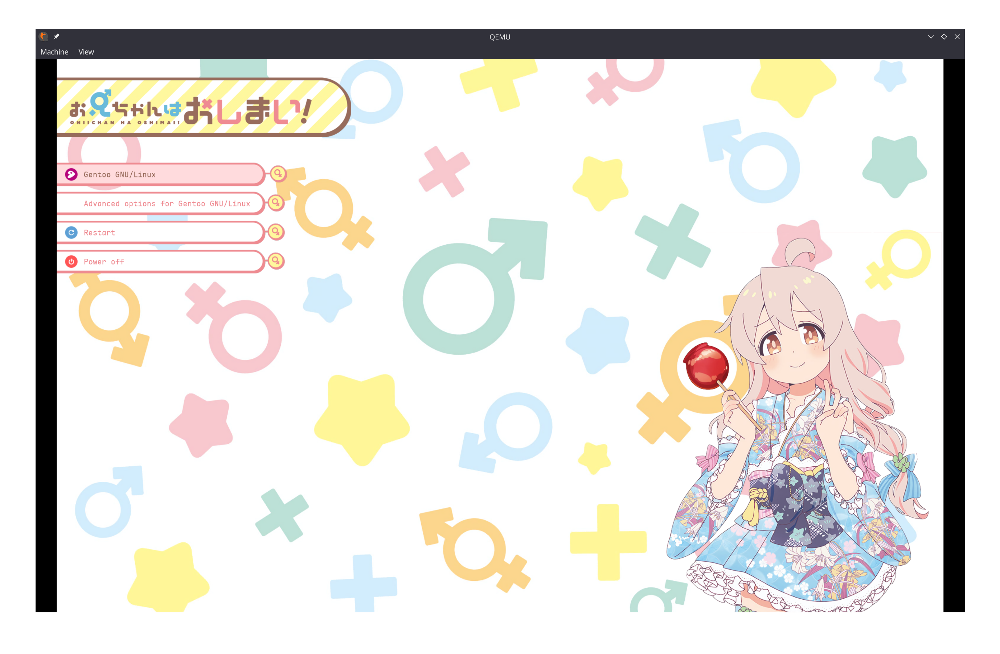
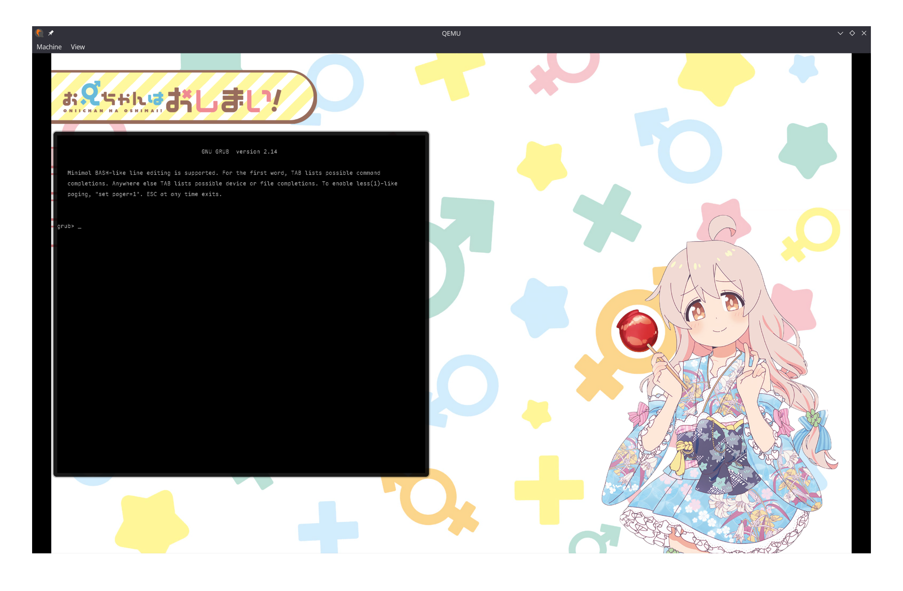

# GRUB Theme Onimai: Mahiro (Yukata) v0.1.0




## Installation

Clone this repository:

``` bash
git clone https://github.com/scetayh/grub-theme-onimai-mahiro-yukata.git
cd grub-theme-onimai-mahiro-yukata/
```

Use `build.sh` to build this theme. Execute `./build.sh --help` for usage.

For example, if you would like to build a theme with pink menu items and an English timeout prompt:

``` bash
chmod +x build.sh
./build.sh -c pink -l en
```

Build artifacts will be found in `themes/onimai_mahiro_yukata`.

Copy them to the local GRUB theme directory (e.g. `/boot/grub/themes/`) or where you want:

``` bash
sudo cp -r themes/onimai_mahiro_yukata/ /boot/grub/themes/
```

Edit `/etc/default/grub` via an editor like `nano` or just append a `GRUB_THEME=...` line to it:

``` bash
sudo echo 'GRUB_THEME="/boot/grub/themes/onimai_mahiro_yukata/theme.txt"' >> /etc/default/grub
```

Regenerate the GRUB configutation (You may need to use `grub2-mkconfig` or `update-grub`, etc. instead):

``` bash
sudo grub-mkconfig -o /boot/grub/grub.cfg
```

After that, you can reboot your system to see if the theme works well:

``` bash
sudo reboot
```